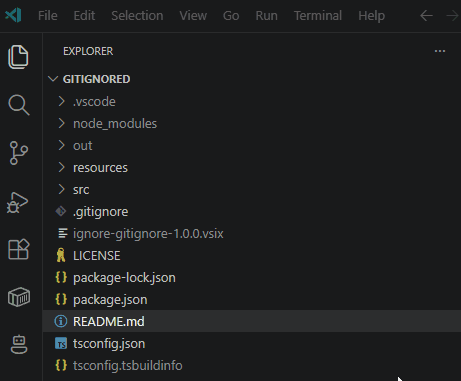
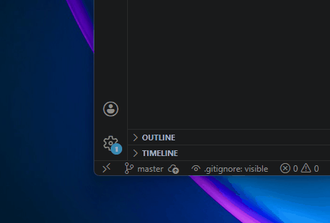
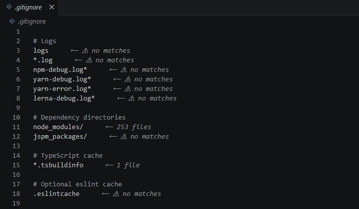

# .gitignored

A minimal VS Code extension that adds a single button to the Explorer toolbar to show or hide files listed in your `.gitignore`.



## Usage

| Control | Action |
|---|---|
| Explorer toolbar button | Toggle visibility |
| Status bar item (bottom-left) | Toggle visibility |
| Command Palette: `Toggle .gitignore'd Files` | Toggle visibility |

The state is saved per-workspace in `.vscode/settings.json` and restored automatically on next open.

## How it works

When **hidden**, the extension reads your root `.gitignore`, converts each pattern to a VS Code glob, and injects them into `files.exclude` in your workspace settings. When **visible**, it removes only the globs it injected — your own `files.exclude` entries are never touched.

The status bar shows the current state at a glance:



- `$(eye) .gitignore: visible` — gitignored files are shown (default)
- `$(eye-closed) .gitignore: hidden` — gitignored files are excluded from the Explorer

If `.gitignore` is modified while files are hidden, the exclude list updates automatically.

### Hover Tooltips

Hover over any line in your `.gitignore` file to see which files match that pattern:



- Plain-English explanations for each pattern
- Match counts showing how many files the pattern matches

## Requirements

- An open workspace folder (single or multi-root)
- A `.gitignore` file at the root of the workspace folder

## Known Limitations

- Negation patterns (`!pattern`) in `.gitignore` are not supported — VS Code's `files.exclude` has no way to express them
- Only reads the root `.gitignore`; nested `.gitignore` files in subdirectories are not picked up

### Why .gitignored?
 
- **One-click toggle** — a dedicated toolbar button right in the Explorer, no menu-diving needed.
- **Status bar feedback** — always know the current state at a glance.
- **Safe settings management** — injects and removes only its own globs; your existing `files.exclude` entries are never touched.
- **Auto-updates** — change your `.gitignore` while files are hidden, and the exclude list refreshes automatically.
- **Lightweight** — no dependencies, no configuration required, works out of the box.


## Comparison with Alternatives
 
There are several other approaches to managing gitignored file visibility in VS Code. Here's how `.gitignored` compares:

### VS Code Built-in Setting (`explorer.excludeGitIgnore`)
 
VS Code introduced the `explorer.excludeGitIgnore` setting in v1.68 (May 2022). It's a simple boolean toggle buried in settings — no toolbar button, no status bar, and no quick toggle from the command palette. Most of the extensions below (including `.gitignored`) exist because the built-in experience lacks convenient, one-click toggling.

### Extension-by-Extension Comparison
 
| Feature | **.gitignored** (this) | **Hide Gitignored** (npxms) | **Toggle Exclude Git Ignore** (earshinov) | **Explorer .gitignore Toggle** (timgthomas) | **Hide Git Ignored** (chrisbibby) | **GitIgnore Visual** (gdrenteria) |
| --- | :---: | :---: | :---: | :---: | :---: | :---: |
| **Marketplace Installs** | 9 (new) | ~45,000 | ~360 | ~810 | — | new (Jan 2026) |
| **Approach** | `files.exclude` injection | `files.exclude` injection | Toggles built-in `explorer.excludeGitIgnore` | Toggles built-in `explorer.excludeGitIgnore` | Toggles built-in `explorer.excludeGitIgnore` | Visual badges only (no hiding) |
| **Explorer Toolbar Button** | ✅ | ❌ | ❌ | ❌ | ✅ | ❌ |
| **Status Bar Indicator** | ✅ | ❌ | ❌ | ❌ | ✅ | ❌ |
| **Command Palette** | ✅ | ✅ | ✅ | ✅ | ✅ | ✅ |
| **Keyboard Shortcut** | — | — | ✅ (Ctrl+Alt+E) | — | — | — |
| **Auto-refresh on `.gitignore` change** | ✅ | ❌ | N/A (built-in) | N/A (built-in) | N/A (built-in) | ✅ (manual refresh) |
| **Preserves user `files.exclude`** | ✅ | ✅ | N/A | N/A | N/A | N/A |
| **Scope** | Workspace | Workspace | Global (user settings) | Workspace | Workspace | Workspace |
| **Shows _which_ rule matched** | ❌ | ❌ | ❌ | ❌ | ❌ | ✅ (hover tooltip) |
| **Actively Maintained** | ✅ | ⚠️ (limited) | ✅ | ⚠️ (minimal) | ⚠️ (minimal) | ✅ |

## Contributing

Contributions are welcome! To get started:

```bash
git clone https://github.com/juniorraja/gitignored.git
cd gitignored
npm install
npm run compile
```

Press **F5** in VS Code to launch the Extension Development Host and test your changes.

To build a VSIX locally:

```bash
npm install -g @vscode/vsce
vsce package
```

Feel free to open an [issue](https://github.com/juniorraja/gitignored/issues) or submit a pull request.

## License

[MIT](LICENSE)
